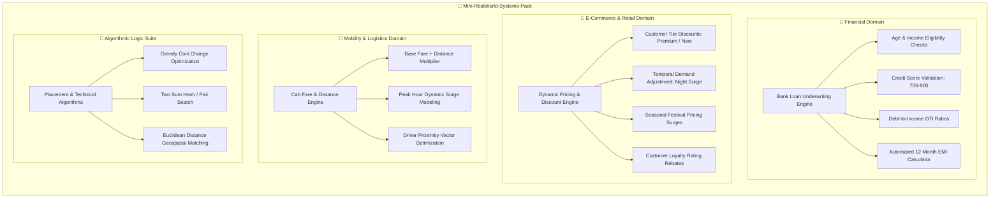

# 💼 Mini Real-World Systems & Algorithms Pack

[](https://www.python.org/downloads/)
[](BankLoanSystem/)
[](Algorithms/)
[](LICENSE)

> A curated collection of modular Python systems modeling real-world business logic (banking loan underwriting, dynamic e-commerce pricing, ride-hailing surge calculations) paired with classical algorithmic problem-solving implementations.

---

## 📑 Table of Contents
- [Architecture & Module Overview](#-architecture--module-overview)
- [Module Catalog](#-module-catalog)
  - [1. Banking & Loan Underwriting System](#1-banking--loan-underwriting-system)
  - [2. Dynamic E-Commerce Pricing Engine](#2-dynamic-e-commerce-pricing-engine)
  - [3. Ride-Hailing Cab Fare & Surge Calculator](#3-ride-hailing-cab-fare--surge-calculator)
  - [4. Classical Algorithms & Logic Suite](#4-classical-algorithms--logic-suite)
- [Repository Structure](#-repository-structure)
- [How to Run](#-how-to-run)
- [Author & Connect](#-author)
- [License](#-license)

---

## 📐 Architecture & Module Overview



---

## 🚀 Module Catalog

### 1. 🏦 Banking & Loan Underwriting System
*📁 Directory:* [`BankLoanSystem/`](BankLoanSystem/) | *Script:* `BankLoanEligible.py`
* **Real-World Problem**: Automates credit risk assessment and monthly loan installment computation for retail banking applicants.
* **Decision Pipeline**:
  - Validates applicant age eligibility ($21 < \text{age} < 60$).
  - Enforces minimum monthly income threshold ($\ge \text{₹}25,000$).
  - Audits credit score against risk parameters ($700 \le \text{Score} \le 900$).
  - Enforces Debt-to-Income (DTI) bounds: Existing obligations must not exceed $50\%$ of monthly income.
  - Computes monthly Equated Monthly Installment (EMI) with $10\%$ simple interest over a 12-month tenure:
    $$\text{EMI} = \frac{\text{Principal} + (\text{Principal} \times 0.10)}{12}$$

---

### 2. 🛒 Dynamic E-Commerce Pricing Engine
*📁 Directory:* [`ECommercePricingSystem/`](ECommercePricingSystem/) | *Script:* `EComDynPricSys.py`
* **Real-World Problem**: Simulates dynamic revenue management algorithms used by platforms like Amazon or Flipkart to optimize cart conversions and margins.
* **Decision Pipeline**:
  - **Tier Rebates**: Applies $15\%$ discount for `Premium` members, $5\%$ for `New` customers.
  - **Time-of-Purchase Surge**: Adds $10\%$ during peak night shopping traffic.
  - **Festival Season Surge**: Incorporates $20\%$ demand adjustments during holiday seasons.
  - **High-Rating Reward**: Delivers an extra $5\%$ loyalty discount for customer satisfaction ratings $\ge 4.7/5.0$.

---

### 3. 🚖 Ride-Hailing Cab Fare & Surge Calculator
*📁 Directory:* [`TravelFareSystem/`](TravelFareSystem/) | *Script:* `CabFareFeeCal.py`
* **Real-World Problem**: Models the fare dispatch algorithms implemented by ride-sharing services like Uber and Ola.
* **Decision Pipeline**:
  - **Base Tariff**: Calculates fundamental trip cost:
    $$\text{Fare}_{\text{base}} = \text{₹}50 + (\text{₹}10 \times \text{Distance in km})$$
  - **Peak Hour Surge**: Automatically applies a $25\%$ surge markup during high-traffic commute intervals.
  - **Customer Rating Discount**: Applies a $10\%$ incentive deduction for riders with ratings exceeding $4.5/5.0$.

---

### 4. 🧩 Classical Algorithms & Logic Suite
*📁 Directory:* [`Algorithms/`](Algorithms/)
* **Focus**: Foundational computational algorithms and data structure implementations commonly assessed in technical interviews:

| Script | Algorithm / Topic | Complexity | Description |
| :--- | :--- | :--- | :--- |
| `CoinChangeProblem.py` | **Greedy Optimization** | $O(N \log N)$ | Finds minimum coin denominations required to construct a target amount. |
| `TwoSum.py` | **Search / Pair Matching** | $O(N^2)$ | Identifies pairs of indices within an array whose elements sum to a target value. |
| `DisOfCusDriv.py` | **Euclidean Distance** | $O(D)$ | Calculates 2D spatial distance $\sqrt{(x_2-x_1)^2 + (y_2-y_1)^2}$ to dispatch nearest driver. |
| `AttPerCal.py` | **Threshold Auditing** | $O(1)$ | Computes academic attendance compliance against the statutory $75\%$ requirement. |
| `DelCharCal.py` | **String Manipulation** | $O(N)$ | Character deletion and ASCII parsing logic. |

---

## 📁 Repository Structure

```text
Mini-RealWorld-Systems-Pack/
├── BankLoanSystem/
│   ├── BankLoanEligible.py         # Underwriting & EMI calculation script
│   └── README.md                   # Banking system documentation
├── ECommercePricingSystem/
│   ├── EComDynPricSys.py           # Dynamic e-commerce pricing engine
│   └── README.md                   # Pricing model documentation
├── TravelFareSystem/
│   ├── CabFareFeeCal.py            # Ride-hailing fare calculation script
│   └── README.md                   # Mobility system documentation
├── Algorithms/
│   ├── CoinChangeProblem.py        # Greedy coin change optimization
│   ├── TwoSum.py                   # Pair sum identification
│   ├── DisOfCusDriv.py             # Spatial closest-driver dispatch
│   ├── AttPerCal.py                # Attendance audit script
│   ├── DelCharCal.py               # String processing logic
│   └── README.md                   # Algorithms suite documentation
├── LICENSE                         # MIT open source license
└── README.md                       # Master portfolio pack documentation
```

---

## 🚀 How to Run

Clone the repository and run any module directly using Python 3:

```bash
git clone https://github.com/ranjithbrs/Mini-RealWorld-Systems-Pack.git
cd Mini-RealWorld-Systems-Pack

# 1. Run Bank Loan Underwriting
python BankLoanSystem/BankLoanEligible.py

# 2. Run Dynamic E-Commerce Pricing
python ECommercePricingSystem/EComDynPricSys.py

# 3. Run Cab Fare Calculator
python TravelFareSystem/CabFareFeeCal.py

# 4. Run Greedy Coin Change Algorithm
python Algorithms/CoinChangeProblem.py
```

---

## 👨‍💻 Author

**Ranjith B**  
🎓 *B.Tech Computer Science & Business Systems (CSBS)*  
🏛️ *Nehru Institute of Engineering and Technology, Coimbatore*  

- 💼 **LinkedIn**: [linkedin.com/in/ranjith-b-85907831a](https://linkedin.com/in/ranjith-b-85907831a)  
- 🐙 **GitHub**: [github.com/ranjithbrs](https://github.com/ranjithbrs)  
- 🌐 **Portfolio**: [ranjithbrs.github.io/portfolio](https://ranjithbrs.github.io/portfolio/)  
- 📧 **Email**: ranjithb2k06@gmail.com  

---

## 📄 License

This project is licensed under the [MIT License](LICENSE).
